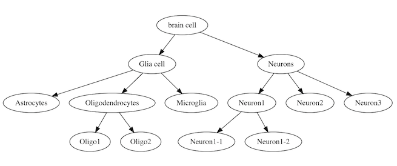

```{r, include = FALSE}
knitr::opts_chunk$set(
  collapse = TRUE,
  warning=FALSE, 
  message=FALSE,
  comment = "#>"
)
```


In this tutorial we illustrate the usage of MRtree functions using a simulated dataset. The data is simulated from [SymSim](https://github.com/YosefLab/SymSim) by supplying a tree structure as shown below, containing UMI counts of 500 cells on 500 genes:

```{r, echo=F, message=F}
devtools::load_all()
```

```{r, eval=F}
library(mrtree)
```

```{r, warning=F, fig.width=5, fig.height=3}
# # The data simulation can be performed using SymSim package with the following wrapper function,
# # The following simulation code take some time to run (skip to load data with data("data_example"))
# tree = tree1(plot=T)$phylo.tree
# symsim.param.zeisel = list(gene_effects_sd=2, sigma=0.2, scale_s=0.4, alpha_mean=0.5, alpha_sd=0.025,
#                            depth_mean=2e5,depth_sd=1.5e4, nPCR1=14, prop_hge=0.01, mean_hge=3)
# ngenes = 500
# ncells = 500
# truek = 8; min_popsize = floor(ncells/truek)
# i_minpop =  which(tree$tip.label=='Microglia')
# 
# 
# seed =  42
# simu.out = generateDataSymSim(ncells=ncells, ngenes=ngenes, tree=tree,
#                               params=symsim.param.zeisel, plot.tsne=T,
#                               i_minpop=i_minpop, min_popsize=min_popsize,
#                               nevf=150, n_de_evf=40, sigma=0.9, seed=seed)
# 
# simu.out$tsne_UMI_counts
# dat = simu.out
# # data_example = simu.out; usethis::use_data(data_example)

data("data_example", package = 'mrtree') # load data
dat = data_example
# tsne plot of 500 cells
dat$tsne_UMI_counts
```

The main function to perform MRtree analysis is ``mrtree()``, where the data input is one of the following:

* An n-by-m matrix of labels, where n is the number of cells, m is the number of clustering resolutions
* A dataframe, with the targeted column prefix/suffix specified in prefix /suffix
* Seurat object with multiresolution clustering results
* SingleCellExperiment (SC3) object with multiresolution clustering results

``sc_clustering_methods.R`` file provide a few clustering warppers including:

* ``sc_clustering.seurat``, graph clustering provided by [Seurat](https://satijalab.org/seurat/) package (@RN226)
* ``sc_clustering.sc3``, Consensus clustering provided by [SC3](https://github.com/hemberg-lab/SC3) package (@RN33)
* ``sc_clustering.soup``, Semi-soft clustering provided in [SOUP](https://github.com/lingxuez/SOUPR) package (@RN195)
* ``sc_clustering.tsne_kmeans``, TSNE + Kmeans clustering
* ``sc_clustering.umap_kmeans``, UMAP + Kmeans clustering

### MRtree with Seurat clustering 

As first step, multi-resolution flat clustering is conducted using Seurat with a range of resolution parameters. The results can be visualized using a cluster tree, where each layer represent one clustering, the tree nodes represent clusters, and edge exists between clusters in adjacent layers if two clusters share data points.

```{r, fig.width=7, fig.height=4}
set.seed(42)

metadata = dat$metadata
rownames(metadata) = dat$metadata$cellid
ref.labels = dat$metadata$type

# specify the resolution parameters
# resolutions = seq(0.1, sqrt(3), 0.05)^2

# alternatively and preferrably, we provide a sampling tool to sample resolution parameters to uniformly cover different scales
A = seurat_get_nn_graph(counts=dat$counts, metadata=metadata, npc=10)
resolutions = modularity_event_sampling(A=A, n.res=30, gamma.min=0.01, gamma.max=2.5) # sample based on the similarity matrix

# clustering using Suerat 
seurat.out = sc_clustering.seurat(counts=dat$counts, resolutions=resolutions, metadata=metadata, npcs=10,
                                  min.cells=0, min.features=0, scale.factor=10000, return.seurat.object=T,
                                  vars.to.regress=NULL, find.variable.features=F, verbose=F)

# initial cluster tree from Seurat flat clustering
plot_clustree(labelmat=seurat.out$seurat.clusters, prefix ='RNA_snn_res.', 
              ref.labels = ref.labels, plot.ref = F)
```

Then we apply MRtree to ubtain the hierarchical cluster tree, visualized using a dendrogram, with a pie chart on each tree node detailing the cluster composition given the known true labels.

```{r, warning=F, message=F, results = FALSE, fig.width=7, fig.height=4}
out = mrtree(seurat.out$obj, consensus=F, augment.path=F)
# if there are few partitions per k, within resolution consensus step can speed up the algorithm
# weight per sample is encoraged if the classes are imbalanced

plot_tree(labelmat=out$labelmat.mrtree, ref.labels=ref.labels, plot.piechart = T,
          node.size = 0.4, tip.label.dist = 10, bottom.margin=30 )
```

We evaluate te per-resolution clustering performance with a novel index adapted from Adjusted Rand Index to accrount for te bias for resolution.

```{r, fig.width=5, fig.height=3}
ks.flat = apply(out$labelmat.flat, 2, FUN=function(x) length(unique(x)))
ks.mrtree = apply(out$labelmat.mrtree, 2, FUN=function(x) length(unique(x)))
amri.flat = sapply(1:ncol(out$labelmat.flat), function(i) AMRI(out$labelmat.flat[,i], ref.labels)$amri)
amri.flat = aggregate(amri.flat, by=list(k=ks.flat), FUN=mean)
amri.recon = sapply(1:ncol(out$labelmat.mrtree), function(i) AMRI(out$labelmat.mrtree[,i], ref.labels)$amri)

df = rbind(data.frame(k=amri.flat$k, amri=amri.flat$x, method='Seurat flat'), 
           data.frame(k=ks.mrtree, amri=amri.recon, method='MRtree'))
ggplot2::ggplot(data=df, aes(x=k, y=amri, color=method)) + geom_line() + theme_bw()
```
We calcuate the similarity between the initial flat clustering and MRtree clusters across scales. Lower similarity indicates the selected clustering algorithm is not able to generate stabel clusters at the specific resolution. In this case stability drops steeply when $k>8$.

```{r, fig.width=5, fig.height=3}
stab.out = stability_plot(out)
stab.out$plot
```

### MRtree with SC3 clustering 

```{r, show = "hide", message=F}
ks = 2:10
clusterings.per.k = 1

set.seed(1)
clust.out =  sc_clustering.sc3(exprs=dat$counts, Ks=rep(ks, each=clusterings.per.k), type = 'counts', colData=metadata,
                                biology = F, n_cores = NULL, gene_filter = F, pct_dropout_min=-1)
```

Plot the initial clustering reults from SC3
```{r, fig.width=7, fig.height=4,  show = "hide"}
plot_clustree(labelmat=clust.out$sce@colData, prefix='sc3_', suffix = "_clusters",
              ref.labels = ref.labels, plot.ref = F)
```

Run MrTree and plot the tree:
```{r, warning=F, message=F, results = FALSE, fig.width=7, fig.height=4}
out = mrtree(clust.out$sce, prefix='sc3_', suffix = "_clusters", consensus=F, sample.weighted=F)

plot_tree(labelmat=out$labelmat.mrtree, ref.labels=ref.labels, plot.piechart = T,
          node.size = 0.4, tip.label.dist = 10, bottom.margin=30 )
```


We evaluate te per-resolution clustering performance via AMRI:

```{r, fig.width=5, fig.height=3}
ks.flat = apply(out$labelmat.flat, 2, FUN=function(x) length(unique(x)))
ks.mrtree = apply(out$labelmat.mrtree, 2, FUN=function(x) length(unique(x)))
amri.flat = sapply(1:ncol(out$labelmat.flat), function(i) AMRI(out$labelmat.flat[,i], ref.labels)$amri)
amri.flat = aggregate(amri.flat, by=list(k=ks.flat), FUN=mean)
amri.recon = sapply(1:ncol(out$labelmat.mrtree), function(i) AMRI(out$labelmat.mrtree[,i], ref.labels)$amri)

df = rbind(data.frame(k=amri.flat$k, amri=amri.flat$x, method='SC3 flat'), 
           data.frame(k=ks.mrtree, amri=amri.recon, method='MRtree'))
ggplot2::ggplot(data=df, aes(x=k, y=amri, color=method)) + geom_line() + theme_bw()
```

We calcuate the similarity between the initial flat clustering and MRtree clusters across scales. 

```{r, fig.width=5, fig.height=3}
stab.out = stability_plot(out)
stab.out$plot
```


# Reference


